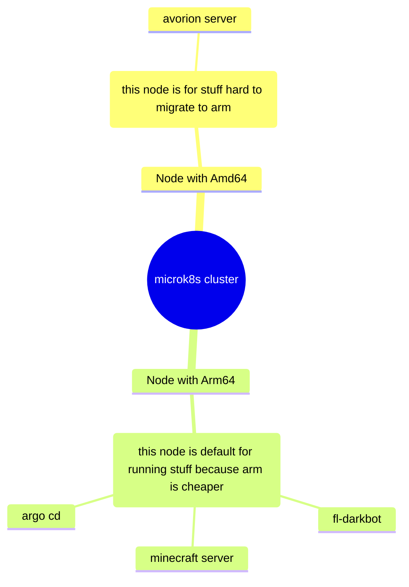

# Description

This repository is for:
- raising servers/cluster for pet projects
- For infra specific applications (monitoring stuff for example)
- and for reusable modules/infra templates for reusage in other repositories

# links to projects running here:

| Link          | Logo |
| ------------- | ------------- |
| [microk8s](tf/modules/ansible_microk8s/)  |   |
| [fl-darkbot](<https://github.com/darklab8/fl-darkbot>)  |    |
| [game-servers](<https://github.com/darklab8/infra-game-servers>)  |    |
| [argocd](tf/modules/kube_argo/)  |    |

# Infra

