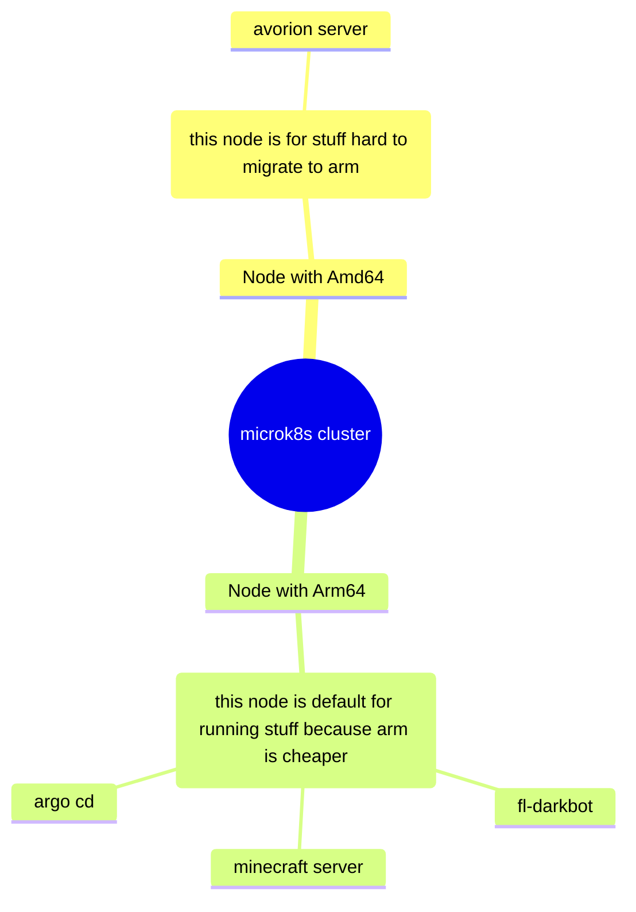

# Description

This repository is for:
- raising servers/cluster for pet projects
- For infra specific applications (monitoring stuff for example)
- and for reusable modules/infra templates for reusage in other repositories

# Infra

links to projects running here:
- [fl-darkbot](<https://github.com/darklab8/fl-darkbot>)
- [game-servers](<https://github.com/darklab8/infra-game-servers>)
