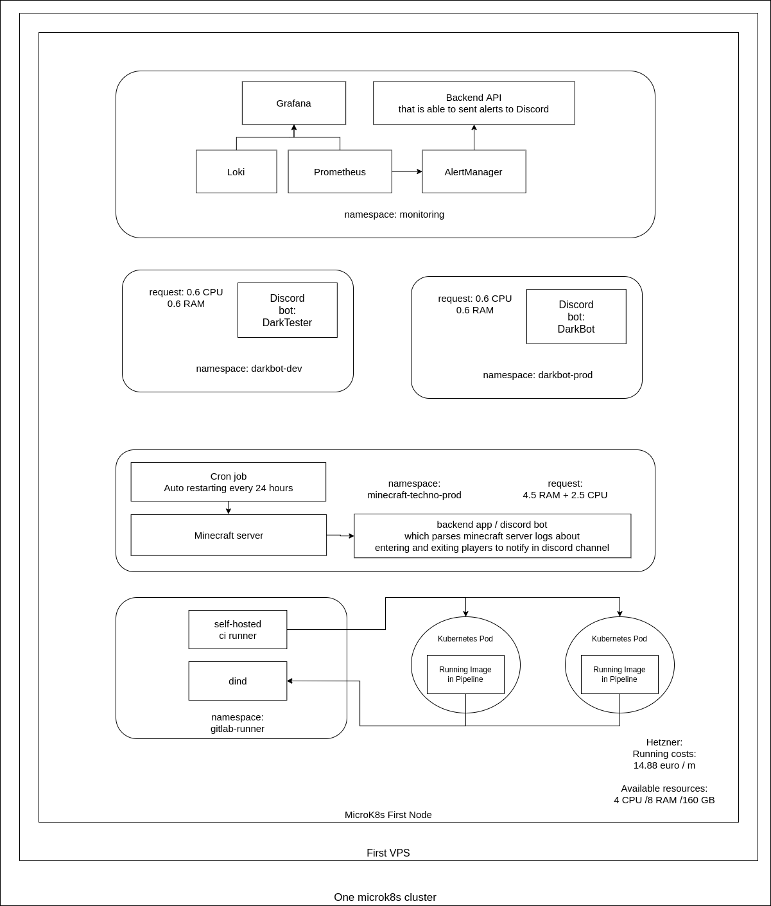

 # Description

This is a homelab for darkwind's pet projects. Exists purely for fun and learning.

# Projects:

* infrastructure: microk8s setting up scripts to contain the homelab

* pipeliner: self hosted gitlab CI

* darkbot: discord bot for [Discovery Freelancer community](https://discoverygc.com/forums/index.php)

* minecraft_techno_server: minecraft server with electro technical moddifications

* goping: script to query same resource multiple times with one CPU in golang. Available as public docker image.

* monitoring: Prometheus + Loki + Grafana + AlertManager

* backups: some scripts to backup/restore stateful data for darkbot and minecraft server

  

# Draw IO representation

