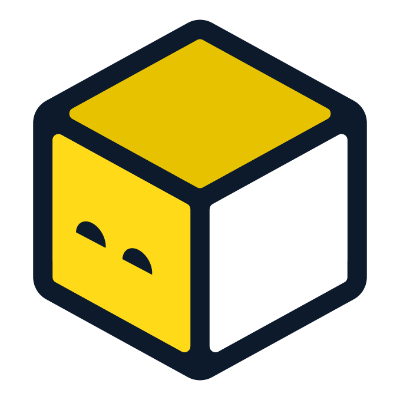
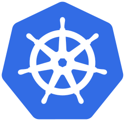

# Description

This repository is for:

- raising servers/cluster for pet projects
- For infra specific applications (monitoring stuff for example)
- and for reusable modules/infra templates for reusage in other repositories

# Languages in use

| name                                                  | Logo                                                                           | purpose                                                                      |
| ------------------------------------------------------- | -------------------------------------------------------------------------------- | ------------------------------------------------------------------------------ |
| [Docker](https://www.docker.com/)                     |                                                                                | App as a code with reproducability of a saved image to which we can rollback |
| [Opentofu](https://opentofu.org/)                     |            | to setup Hetzner, DNS at cloudflare and docker containers and services.      |
| [Github Actions](https://github.com/features/actions) |  | for automated testing and deployments in a fully GitOps way                  |
| [KCL](https://www.kcl-lang.io/)                       |        | To setup yaml of Github Actions with static typing and code reusage          |

# Projects here of using this repo code and infra:

| Link                                                                     | Logo                                                                                                                                                   | Description                                          |
| -------------------------------------------------------------------------- | -------------------------------------------------------------------------------------------------------------------------------------------------------- | :----------------------------------------------------- |
| [docker swarm](https://docs.docker.com/engine/swarm/)                    |                                                                                   | simple container scheduler controlled by terraform   |
| [caddy docker proxy](https://github.com/lucaslorentz/caddy-docker-proxy) |                                                                                   | reverse proxy and tls by labels to docker containers |
| [fl-darkbot](https://github.com/darklab8/fl-darkbot)                     |                                                                                 | discord bot for Discovery Freelancer community       |
| [fl-darkstat](https://github.com/darklab8/fl-darkstat)                   |                                                                                | game data navigational tool for Freelancer           |
| [microk8s](tf/modules/ansible_microk8s/)                                 |                                                                               | k8s cluster for experiments                          |
| [argo-cd](https://argoproj.github.io/cd/)                                |                                                                                 | for experimental deploys to k8s                      |
| [game-servers](https://github.com/darklab8/infra-game-servers)           |   | personal game servers, minecraft and avorion         |

